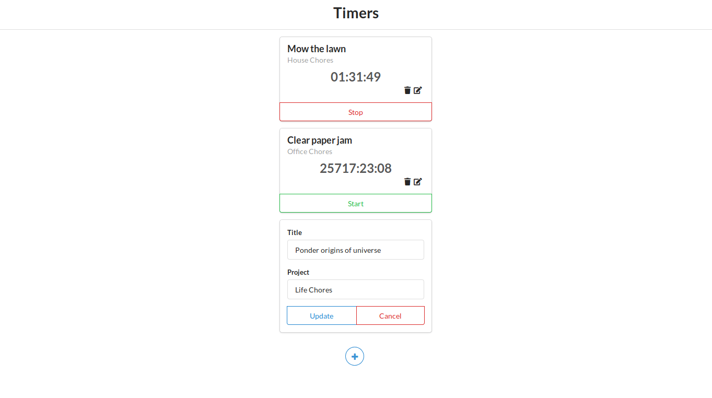

# Time Tracking App :clock3:
Exercise of the book **_FULLSTACK REACT: The Complete Guide to ReactJS and Friends_**

<br><p align="center">

</p>

### Steps
Step 1: Clone or download the repo.

Step 2: Switch to your repository's directory
```
cd /path/to/your/repo
```

Step 3: Switch to your server directory
```
cd server
```

Step 4: Install dependencies
```
npm install
```

Step 5: Run the server
```
npm start
```

Step 6: Open a new terminal in your repository's directory

Step 7: Install dependencies
```
npm install
```

Step 8: Run the client
```
npm start
```

Made with &#10084; by bryandms
